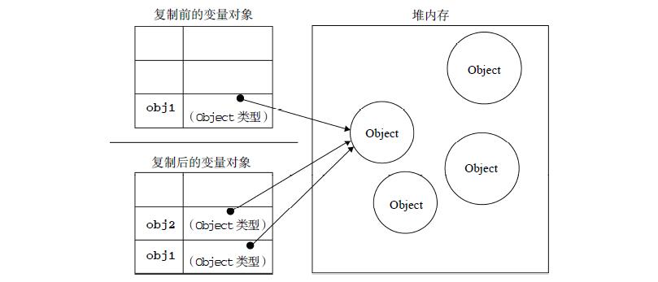

# 复制变量值

基本类型的复制：会在变量对象上创建一个新值，然后把该值复制到为新变量分配的位置上：

```javascript
var num1 = 5;
var num2 = num1;
```

在此，num1 中保存的值是5。当使用num1 的值来初始化num2 时，num2 中也保存了值5。但num2中的5 与num1 中的5 是完全独立的，该值只是num1 中5 的一个副本。


当从一个变量向另一个变量复制引用类型的值时，同样也会将存储在变量对象中的值复制一份放到为新变量分配的空间中。不同的是，这个值的副本实际上是一个**指针**，而这个指针指向存储在堆中的一个对象。

复制操作结束后，两个变量实际上将引用同一个对象，改变其中一个变量，就会影响另一个变量。

```javascript
var obj1 = new Object();
var obj2 = obj1;
obj1.name = "Nicholas";
alert(obj2.name); //"Nicholas"
```


