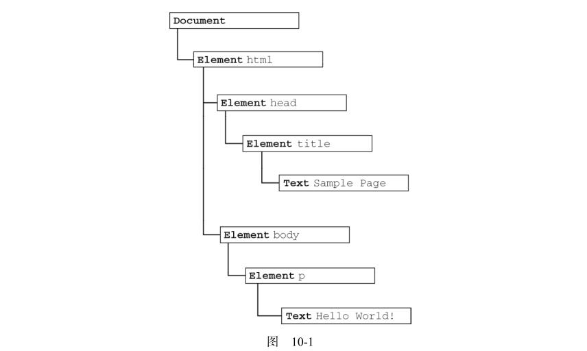

# 节点层次

DOM 可以将任何 HTML 或 XML 文档**描绘成一个由多层节点构成的结构**。

节点分为几种不同的类型，每种类型分别表示文档中不同的信息及（或）标记。

每个节点都拥有各自的**特点、数据**和**方法**，另外也与其他节点存在某种关系。节点之间的关系构成了层次，而所有页面标记则表现为一个**以特定节点为根节点的树形结构**。以下面的 HTML 为例：

```html
<html>
  <head>
    <title>Sample Page</title>
  </head>
  <body>
    <p>Hello World!</p>
  </body>
</html>
```

可以将这个简单的 HTML 文档表示为一个层次结构，如图 10-1 所示。

在这个例子中，文档节点只有一个子节点，即 `<html>` 元素，我们称之为**文档元素**。文档元素是文档的最外层元素，文档中的其他所有元素都包含在文档元素中。**每个文档只能有一个文档元素。**



每一段标记都可以通过树中的一个节点来表示：HTML 元素通过**元素节点**表示，特性（attribute）通过特性节点表示，文档类型通过**文档类型节点**表示，而注释则通过注释节点表示。总共有 12 种节点类型，这些类型都继承自一个基类型。
